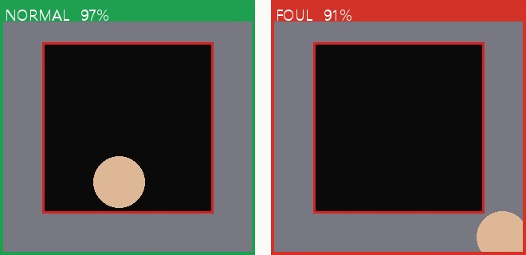
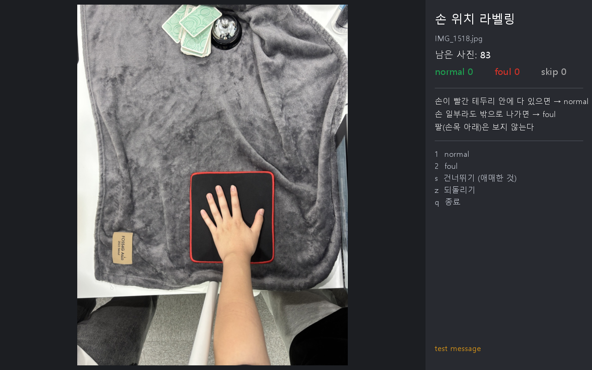

# hand-foul — 손 위치 반칙 분류

위에서 찍은 사진 한 장을 넣으면 손이 마우스패드(빨간 테두리 검정 패드) **안에 있는지(normal)**, **조금이라도 밖으로 나갔는지(foul)** 를 판단하는 이미지 분류기입니다.
학습 코드 · 추론 코드 · 라벨링 도구가 하나의 파이썬 패키지(`hand_foul`)와 CLI(`hand-foul`)로 들어 있습니다.



> 결과는 원본 사진 위에 **초록(normal) / 빨강(foul)** 테두리와 `LABEL 93%` 배너를 얹은 이미지로 나옵니다. 위 그림은 더미 이미지로 만든 출력 형식 예시입니다.

---

## 1. 설치

```bash
# PyTorch를 먼저 설치하면 GPU 빌드를 고를 수 있습니다 (CPU만 있어도 동작).
#   https://pytorch.org/get-started/locally/

pip install git+https://github.com/2chong/hand-foul.git
# 또는 clone 후
pip install .
```

설치되면 `hand-foul` 명령과 `hand_foul` 파이썬 패키지를 쓸 수 있습니다.

## 2. 학습된 가중치로 바로 추론하기

가중치 파일(`best.pt`, ResNet18 기준 약 45 MB)은 **GitHub Release** 에 첨부합니다. 받아서 `weights/best.pt` 에 두거나, URL을 그대로 넘겨도 됩니다(처음 한 번 `~/.cache/hand_foul/` 에 받아둠).

```bash
# 사진 1장 → 창에 결과 표시 + predictions/photo_pred.jpg 저장
hand-foul predict photo.jpg

# 폴더 통째로 → predictions/ 에 *_pred.jpg 와 results.json 저장 (창은 안 띄움)
hand-foul predict my_photos/

# 옵션
hand-foul predict photo.jpg -w https://github.com/2chong/hand-foul/releases/download/v0.1.0/best.pt
hand-foul predict my_photos/ --show            # 폴더도 한 장씩 창으로 보기 (아무 키로 다음)
hand-foul predict photo.jpg --no-save --no-show  # 터미널 출력만
```

```python
from hand_foul import Classifier

clf = Classifier.from_pretrained("weights/best.pt")        # 경로 또는 URL
result = clf.predict("photo.jpg")
# {'label': 'foul', 'confidence': 0.93, 'probs': {'normal': 0.07, 'foul': 0.93}}

clf.show("photo.jpg")                        # 창으로 표시
clf.show("photo.jpg", save="out.jpg")        # 파일로 저장 (창은 안 띄움)
img = clf.annotate("photo.jpg")              # PIL.Image 로 받기
clf.predict_folder("my_photos/")             # [(Path, result), ...]
```

입력은 경로, `PIL.Image`, OpenCV `ndarray`(BGR) 모두 됩니다. JPG/PNG 외에 아이폰 **HEIC** 도 그대로 읽고, 폰 사진의 EXIF 회전은 자동으로 적용됩니다.

## 3. 내 데이터로 다시 학습하기

### 3-1. 사진 라벨링 (`hand-foul label`)

1. 찍은 사진을 전부 `data/inbox/` 에 넣습니다 (파일명만 안 겹치면 됨).
2. `hand-foul label` 을 실행하면 창이 뜨고 사진이 한 장씩 크게 보입니다.

| 키 | 동작 |
|---|---|
| `1` | normal → `data/normal/` 로 이동 |
| `2` | foul → `data/foul/` 로 이동 |
| `s` | 애매한 것 건너뛰기 → `data/skip/` 로 이동 |
| `z` | 직전 것 되돌리기 (inbox 로 다시 옴) |
| `q` / `Esc` | 종료 |



- 파일이 **이동**되므로 중간에 꺼도 다음에 켜면 inbox 에 남은 것부터 이어서 합니다.
- 화면 오른쪽에 남은 장수, 지금까지의 normal / foul / skip 개수, 라벨 규칙 세 줄이 항상 보입니다.
- 라벨 기준의 자세한 내용(애매한 경우 표)은 `02_labeling_guide.html` 참고. **애매하면 `s`** 로 빼는 것이 원칙입니다.

### 3-2. 학습 (`hand-foul train`)

```bash
hand-foul train --data data/
```

데이터 폴더는 두 가지 형태 중 하나면 됩니다.

```
# A) 평평한 구조 (라벨링 도구가 만드는 형태) → seed 고정 랜덤으로 70/15/15 분할
data/
  normal/  *.jpg
  foul/    *.jpg
  (inbox/, skip/ 은 무시)

# B) 미리 나눠 둔 구조 → 그대로 사용 (test 에 train 에 없는 사람 손을 넣고 싶을 때)
data/
  train/normal/  train/foul/
  val/normal/    val/foul/
  test/normal/   test/foul/
```

학습이 끝나면 터미널에 **test 정확도, confusion matrix, 클래스별 precision / recall** 이 출력되고 다음 파일이 생깁니다.

```
weights/best.pt                       ← 추론에 쓰는 가중치 (val 정확도 최고 epoch)
runs/<날짜시간>/
  best.pt                             ← 같은 가중치 복사본
  confusion_matrix.png                ← test 셋 confusion matrix 그림
  metrics.json                        ← test 정확도, confusion matrix, per-class P/R/F1
  history.json                        ← epoch 별 train/val loss·acc
  split.json                          ← 어떤 파일이 train/val/test 로 갔는지
```

자주 쓰는 옵션 (`hand-foul train --help` 로 전체 확인):

```bash
hand-foul train --data data/ --epochs 30 --batch-size 8          # 메모리가 작을 때
hand-foul train --data data/ --img-size 384                       # 더 빠르게
hand-foul train --data data/ --backbone mobilenet_v3_large        # 더 가벼운 모델 (가중치 ~17 MB)
hand-foul train --data data/ --device cpu                         # GPU 없이
hand-foul train --data data/ --run-name exp1 --out weights/exp1.pt
```

### 3-3. 따로 모은 테스트셋으로 성능 평가 (`hand-foul eval`)

학습에 안 쓴 사진으로 진짜 성능을 재려면, 정답대로 `normal/` `foul/` 폴더에 나눠 넣고 실행합니다. (사진을 `tests_set/inbox/` 에 넣고 `hand-foul label --data tests_set` 으로 키를 눌러 나눠도 됩니다.)

```
tests_set/
  normal/  *.jpg
  foul/    *.jpg
```

```bash
hand-foul eval tests_set
```

정확도, confusion matrix, 클래스별 precision / recall 과 **틀린 사진 목록**이 출력되고, `eval/` 에 `confusion_matrix.png`, `metrics.json`, `results.json`, 틀린 사진의 결과 이미지(`wrong/`)가 저장됩니다. `--save-all` 을 붙이면 맞은 사진도 `correct/` 에 저장합니다.

### 3-4. 가중치 배포

`weights/*.pt` 는 `.gitignore` 되어 있습니다. 학습한 `weights/best.pt` 를 GitHub Release 에 첨부하고, 그 URL 을 README 의 `-w` 예시에 적어 두면 다른 사람은 `Classifier.from_pretrained(URL)` 로 바로 씁니다. ResNet18 가중치는 약 45 MB 라 레포에 직접 넣지 않고 Release 를 사용합니다.

## 4. 실시간 판정 (`hand-foul live`)

카메라 영상을 프레임마다 판정해서, foul 이면 화면 **가장자리를 굵은 빨간색**으로 깜빡이며 `WARNING` 을 띄우고, normal 이면 얇은 초록 테두리를 그립니다.

```bash
hand-foul live                       # 기본 웹캠 (index 0)
hand-foul live --source 1            # 다른 카메라
hand-foul live --source http://192.168.0.12:8080/video   # 휴대폰 IP 카메라
```

키: `q` 종료, `s` 현재 화면을 `live_captures/` 에 저장.
옵션: `--threshold 0.5` (경고 기준 foul 확률), `--smoothing 0.6` (깜빡임 억제, 높을수록 부드럽지만 반응이 느림), `--every 2` (CPU 가 느리면 N 프레임마다 판정), `--mirror`.

**휴대폰을 카메라로 쓰는 방법 (Windows)**

| 방법 | 폰 | 사용 |
|---|---|---|
| Windows 11 "연결된 카메라" (휴대폰과 연결 앱) | Android | 설정 → Bluetooth 및 장치 → 모바일 장치 → 연결된 카메라로 사용 → `--source 0` 또는 `1` |
| Camo / DroidCam / Iriun 같은 가상 웹캠 앱 | iPhone, Android | PC 앱 + 폰 앱 설치, USB 나 Wi-Fi 연결 → 웹캠 index 로 열림 (`--source 0`, 안 되면 `1`, `2`) |
| IP Webcam (Android) / DroidCam 의 IP 모드 | Android, iPhone | 같은 Wi-Fi 에서 앱이 알려주는 주소 → `--source http://<폰IP>:8080/video` (DroidCam 은 `:4747/video`) |

학습 사진과 같은 구도(패드를 위에서 내려다보는 각도, 패드 네 변이 다 보이게)로 폰을 고정해야 정확합니다.

## 5. 테스트

```bash
pip install -e ".[dev]"
pytest
```

실제 사진 없이 더미 이미지(회색 담요 + 빨간 테두리 검정 패드 + 살색 원)를 만들어 **학습 → 가중치 저장 → 추론 → 결과 이미지 저장 → CLI** 까지 한 번에 도는 스모크 테스트와, 라벨링 도구의 이동/되돌리기/이어하기 로직 테스트가 들어 있습니다. CPU 에서 15초 안팎입니다.

## 6. 구현에서 정한 것과 이유

| 항목 | 결정 | 이유 |
|---|---|---|
| 프레임워크 | PyTorch + torchvision | 사전학습 백본이 한 줄로 오고, `pip install` 로 배포가 쉬움 |
| 백본 | ResNet18 (ImageNet 사전학습), `--backbone` 으로 교체 가능 | 수백 장 규모 데이터에서 안정적으로 미세조정되고 가벼움 |
| 입력 크기 | 512×512 letterbox (긴 변 맞춤 + 회색 패딩) | 폰 사진에서 패드가 프레임의 15% 정도라 손끝이 선을 넘는 미세한 차이를 보려면 해상도가 필요. **crop 을 안 해서** 패드가 잘리지 않음 |
| 증강 | 상하좌우 flip, 90° 단위 회전, ±8° 회전 + 0.75~1.0 축소, 색상 jitter | 위에서 찍은 사진은 '위쪽' 이 없으므로 flip/90° 회전은 손실 없이 데이터를 8배로. **translate / RandomResizedCrop 은 쓰지 않음** — 패드 가장자리가 잘리면 라벨 의미가 바뀜 |
| 손실 / 최적화 | CrossEntropy(클래스 가중치 + label smoothing 0.05), AdamW lr 1e-4, cosine, 20 epoch, early stop 6 | 두 클래스 수가 다를 수 있어 가중치로 보정. 작은 데이터에 무난한 기본값 |
| 분할 | 평평한 폴더면 seed 42 로 클래스별 70/15/15, 결과를 `split.json` 에 기록 | 재현 가능. 사람별로 나누고 싶으면 B) 구조로 직접 나누면 됨 |
| 모델 선택 | val 정확도 최고(동률이면 val loss 낮은) epoch 저장 | test 는 마지막에 한 번만 봄 |
| 시각화 | PIL 로 테두리 + 배너 그리기, 창은 OpenCV | 한글 폰트 포함 텍스트 렌더링은 PIL 이 편하고, 창 띄우기는 OpenCV 가 의존성이 가장 적음 |
| 확신도 낮을 때 | 별도 표시 없음. 라벨(초록/빨강) + 확신도 % 만 보여줌 | 요청에 따라 단순하게 유지. 필요하면 `probs` 로 직접 판단 가능 |
| CLI | typer | 서브커맨드 + 옵션 파싱이 짧고 `--help` 가 자동 |
| 체크포인트 | `state_dict` + 메타(backbone, img_size, classes) 를 한 `.pt` 에 저장, `weights_only=True` 로 로드 | 다른 사람이 받은 파일 하나로 모델 구성까지 복원 가능 |
| DataLoader | Windows 는 `num_workers=0` 기본 | Windows 의 spawn 방식에서 멀티프로세스 로더가 자주 막힘 |

## 7. 만들지 않은 것

손 검출·키포인트 기반 2단계 파이프라인, 웹 서버·GUI 앱. (실시간 판정은 원래 스펙에서 제외였지만 요청으로 §4 에 추가됨)

## 8. 프로젝트 구조

```
hand_foul/
  __init__.py   Classifier, CLASSES, __version__
  cli.py        hand-foul label | train | predict | eval | live
  data.py       EXIF 로딩, Letterbox/증강, 데이터셋, train/val/test 분할
  model.py      백본 생성, 체크포인트 저장/로드
  train.py      학습 루프, confusion matrix, 지표 저장
  predict.py    Classifier (predict / annotate / show), 폴더 추론
  evaluate.py   라벨된 폴더로 정확도 / confusion matrix / 오답 목록
  live.py       카메라 실시간 판정 (빨간 테두리 WARNING)
  label.py      라벨링 도구 (LabelSession 로직 + OpenCV 창)
  draw.py       폰트 탐색, 결과 이미지 그리기
tests/test_smoke.py
data/{inbox,normal,foul,skip}/   사진 (git 제외)
weights/                          가중치 (git 제외, Release 로 배포)
```
